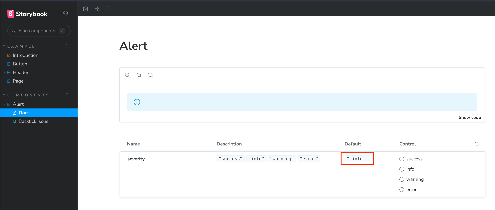

# Issue showcase for Backtick issue with storybook

This README provides information about an issue you may encounter while using Storybook with React and TypeScript. The issue relates to using backticks for default value in component source files.

## Problem
When using backticks to define default prop values in a React component file that is being rendered in Storybook, you may encounter the following error:

Code:
``` tsx ./src/components/Alert.tsx
import { Alert as MuiAlert} from '@mui/material'
import {ComponentProps, FunctionComponent} from 'react'

export const Alert : FunctionComponent<
    {
        children?: ComponentProps<typeof MuiAlert>[`children`]
        severity?: ComponentProps<typeof MuiAlert>[`severity`]
    }
> = ({
         severity = `info`,
         ...props
     }) => (
    <MuiAlert
        {...props}
        severity={severity}
    />
)
```

Error:


